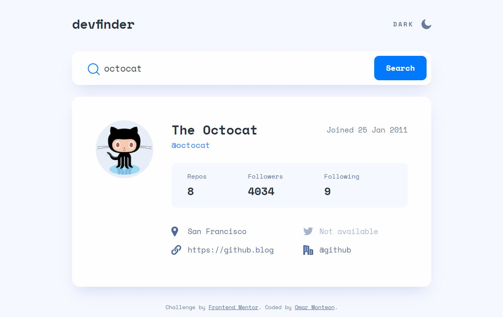

# Frontend Mentor - GitHub user search app solution

This is a solution to the [GitHub user search app challenge on Frontend Mentor](https://www.frontendmentor.io/challenges/github-user-search-app-Q09YOgaH6). Frontend Mentor challenges help you improve your coding skills by building realistic projects.

## Table of contents

- [Overview](#overview)
  - [The challenge](#the-challenge)
  - [Screenshot](#screenshot)
  - [Links](#links)
- [My process](#my-process)
  - [Built with](#built-with)
  - [What I learned](#what-i-learned)
  - [Continued development](#continued-development)
  - [Useful resources](#useful-resources)
- [Author](#author)
- [Acknowledgments](#acknowledgments)

## Overview

### The challenge

Users should be able to:

- View the optimal layout for the app depending on their device's screen size
- See hover states for all interactive elements on the page
- Search for GitHub users by their username
- See relevant user information based on their search
- Switch between light and dark themes
- **Bonus**: Have the correct color scheme chosen for them based on their computer preferences. _Hint_: Research `prefers-color-scheme` in CSS.

### Screenshot

### Links

- Solution URL: [https://github.com/omonteon/github-user-search](https://github.com/omonteon/github-user-search)
- Live Site URL: [https://github-user-search-fem.netlify.app/](https://github-user-search-fem.netlify.app/)

## My process

### Built with

- Semantic HTML5 markup
- CSS custom properties
- Flexbox
- CSS Grid
- Mobile-first workflow
- [React](https://reactjs.org/) - JS library

### What I learned

This project helped me understand CSS grid better. While I'm not an expert yet, I certainly understand better how to build layouts using CSS Grid.
I also learned how to use SVGR, to import svg files in a React project and still be able to style the svg.
Finally, I did some e2e tests using Cypress.

### Continued development

I would like to continue learning about CSS grid, accessibility and testing.

### Useful resources

- [SVGR](https://react-svgr.com/) - This helped me to import svg files easily in the project.
- [Learn CSS GRID](https://scrimba.com/learn/cssgrid) - This Scrimba course helped me understand CSS grid better.

## Author

- Github - [Omar Monteon](https://github.com/omonteon)
- Frontend Mentor - [@omonteon](https://www.frontendmentor.io/profile/omonteon)
